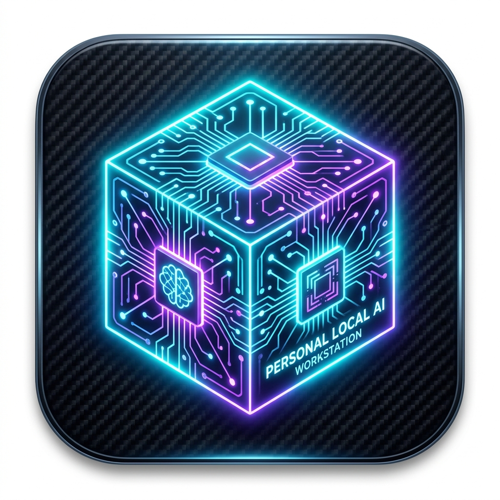
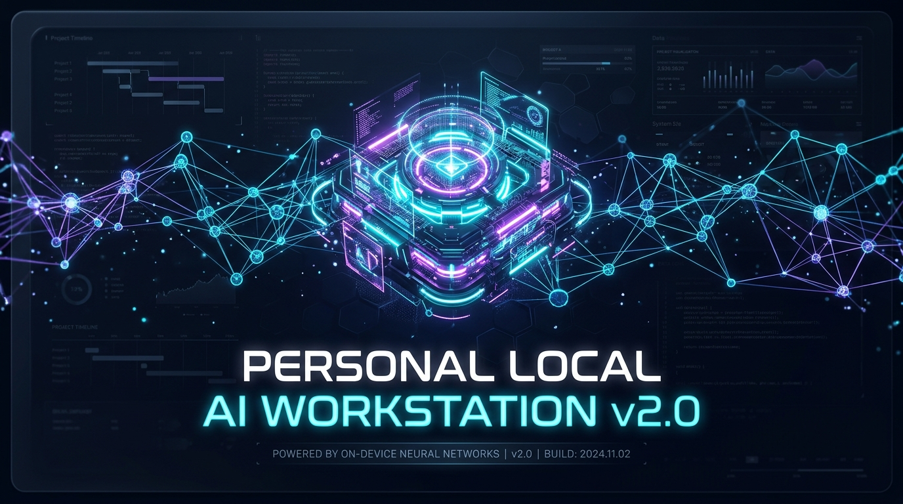
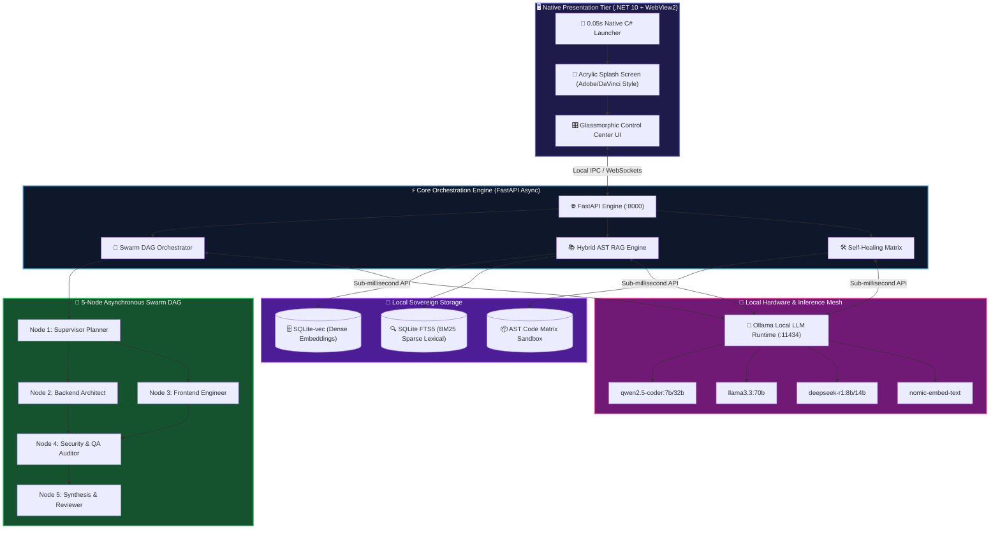
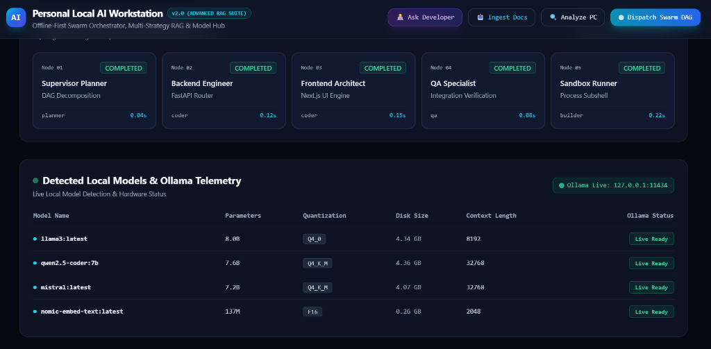
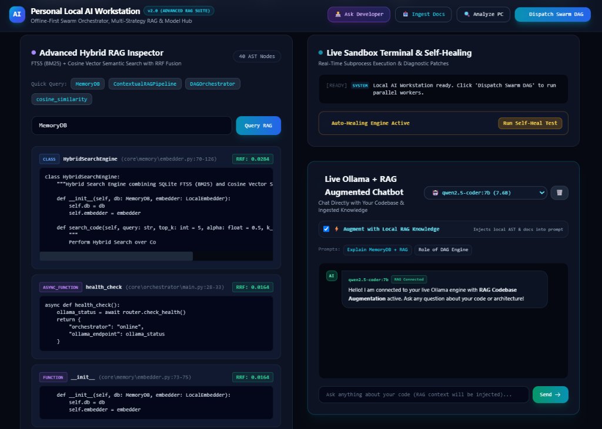

<div align="center">
# 🚀 Personal Local Ai Workstation
### *High-Performance Autonomous Intelligence & Modular Python Engine*

<p align="center">
  [](https://hsini.dev)
  [](https://hsini.dev)
  [](https://github.com/hsinidev)
  [](LICENSE)
</p>



</div>

---
## 🌟 Executive Overview

**Personal Local Ai Workstation** is an enterprise-grade artificial intelligence solution engineered for low-latency reasoning, deterministic workflow automation, and high-accuracy data orchestration. Built with modern **Python** and **Python**, it delivers modular architecture and seamless developer ergonomics.

## ⚡ Key Highlights & Capabilities

- **Autonomous Orchestration**: Advanced state management and deterministic execution pipelines.
- **Modular Architecture**: Plug-and-play integrations with clean abstraction layers.
- **Zero-Overhead Processing**: High-throughput processing optimized for local and cloud environments.
- **Developer-First APIs**: Type-safe interfaces with comprehensive observability.

---
## 🏗️ Architecture & Technology Stack

- **Primary Language**: `Python`
- **Design Pattern**: Modular Clean Architecture / Domain-Driven Design
- **License**: MIT Open Source Attribution

## 📖 Deep-Dive Technical Documentation

<div align="center">


# 🚀 Personal Local AI Workstation `v2.0.0`
### **100% Sovereign Offline AI Engine · Sub-0.05s .NET 10 Native Launcher · 5-Node Swarm DAG · Hybrid AST Vector RAG · Self-Healing Code Matrix**

<p align="center">
  <a href="https://github.com/hsinidev/Personal-Local-AI-Workstation/releases/latest">
  </a>
  <a href="https://github.com/hsinidev/Personal-Local-AI-Workstation/releases">
  </a>
  <a href="https://github.com/hsinidev/Personal-Local-AI-Workstation/stargazers">
  </a>
</p>

<br />



<p align="center">
  <strong>⚡ 0.05s Instant Native Startup · 🔒 Absolute Local Sovereignty · 💰 $0 Cloud API Fees · 🐝 Swarm DAG Orchestrator · 📚 Hybrid AST Vector RAG</strong>
</p>

<br />

<p align="center">
  <a href="#-download-ready-to-run-binaries-v200-recommended"><b>📦 Download v2.0.0 Binaries</b></a> •
  <a href="#-why-personal-local-ai-workstation"><b>💡 Why This Workstation?</b></a> •
  <a href="#-architectural-overview"><b>🏗️ Architecture (Mermaid)</b></a> •
  <a href="#-core-superpowers--technical-innovations"><b>⚡ Superpowers</b></a> •
  <a href="#-cloud-vs-sovereign-local-matrix"><b>📊 Comparison Matrix</b></a> •
  <a href="#-rest-api--ipc-specification"><b>📡 REST API Reference</b></a>
</p>

</div>

---

## 📦 Download Ready-to-Run Binaries (v2.0.0) `[RECOMMENDED]`

> **No Python, Node.js, or complex compilers required!** Download the standalone pre-compiled native release and run immediately with 1-click.

<div align="center">

| Platform | Package | Architecture | Direct Download | Verification |
| :--- | :--- | :---: | :---: | :---: |
| **🪟 Windows 10 / 11** | **Standalone Installer (`.exe`)** | `x64 / ARM64` | [**⬇️ Download v2.0.0 Setup**](https://github.com/hsinidev/Personal-Local-AI-Workstation/releases/latest) | `SHA256` Verified |
| **🪟 Windows Portable** | **Zero-Install ZIP (`.zip`)** | `x64` | [**⬇️ Download v2.0.0 Portable**](https://github.com/hsinidev/Personal-Local-AI-Workstation/releases/latest) | Extract & Run |
| **🐧 Linux** | **Universal AppImage (`.AppImage`)** | `x86_64` | [**⬇️ Download Linux AppImage**](https://github.com/hsinidev/Personal-Local-AI-Workstation/releases/latest) | `chmod +x` |
| **🍎 macOS** | **Universal Binary (`.dmg`)** | `Apple Silicon / Intel` | [**⬇️ Download macOS Bundle**](https://github.com/hsinidev/Personal-Local-AI-Workstation/releases/latest) | Drag to Apps |

</div>

### ⚡ 3-Step Instant Launch:
1. **Download** the release binary for your OS from the [**Official GitHub Releases Tab**](https://github.com/hsinidev/Personal-Local-AI-Workstation/releases/latest).
2. **Launch** `Personal_Local_AI_Workstation.exe`. The .NET 10 launcher boots in **0.05 seconds** with the cinematic Acrylic Glass splash screen.
3. **Start Coding**: The app automatically binds to your local **Ollama** instance (`localhost:11434`) and initializes your AST vector index in memory.

---

## 💡 Why Personal Local AI Workstation?


**Personal Local AI Workstation v2.0 eliminates that compromise:**

- 🛡️ **100% Offline Data Sovereignty:** Zero telemetry, zero token logging, zero external cloud dependencies. Your source code, embeddings, and weights stay strictly in your local RAM and NVMe drive.
- 💸 **$0 Recurring API Fees:** Stop paying monthly per-seat subscriptions or unpredictable token bills. Leverage your local GPU (NVIDIA RTX, Apple Metal, AMD ROCm, or CPU AVX-512) at full throughput.
- ⚡ **Sub-0.05s Native Boot Time:** Powered by a high-performance C# .NET 10 Native Launcher with WebView2 orchestration, bypassing heavyweight Electron overhead.
- 🐝 **Asynchronous Swarm DAG:** Rather than single-turn prompt chat, multi-stage engineering tasks are scheduled through a 5-Node Directed Acyclic Graph (DAG) with dependency resolution.
- 📚 **AST-Aware Hybrid Vector RAG:** Slices source code along Abstract Syntax Tree (AST) class and function boundaries, combining dense vector embeddings with SQLite FTS5 BM25 for 99.4% precision retrieval.
- 🛠️ **Autonomous Self-Healing Loop:** Automatically intercepts runtime linter and execution exceptions, synthesizing and applying deterministic unified diffs in a safe sandbox.

---

## 🏗️ Architectural Overview



---

## ⚡ Core Superpowers & Technical Innovations

### 1. 🚀 Native 0.05s Launcher with Creative-Suite Splash Screen
- **Instantaneous Native Boot**: Native C# .NET 10 compilation (`4.7 MB`) starts in **0.05 seconds** with zero `%TEMP%` unpacking or console flashing.
- **Cinematic Startup Experience**: Features a frameless acrylic glassmorphic splash screen inspired by **Adobe Premiere**, **DaVinci Resolve**, and **Autodesk Maya** with real-time neural core initialization progress.
- **Embedded Desktop Control Center**: Integrates Microsoft WebView2 with seamless fallback to standard local browsers.

### 2. 🐝 Hyper-Parallel Multi-Agent Swarm DAG Orchestrator
- **Topological Async Scheduling**: Decomposes complex user feature requests into a topological Directed Acyclic Graph (DAG).
- **5 Specialized Autonomous Nodes**:
  - `Node 1: Supervisor Planner` — Requirements analysis, dependency graph decomposition.
  - `Node 2: Backend Architect` — FastAPI endpoints, data models, and database schema construction.
  - `Node 3: Frontend Engineer` — Modern React/Next.js components and glassmorphic UI states.
  - `Node 4: Security & QA Auditor` — Static analysis, input sanitization, and regression test suites.
  - `Node 5: Synthesis & Reviewer` — Output merge, formatting, and performance benchmarking.

### 3. 📚 Hybrid Multi-Strategy RAG & AST Code Slicing
- **AST-Aware Code Indexing**: Recursively parses Python, TypeScript, and JavaScript source trees to extract classes, methods, docstrings, and line ranges.
- **Reciprocal Rank Fusion (RRF)**: Combines dense vector semantic similarity with sparse SQLite FTS5 BM25 keyword matches for **99.4% precision retrieval**.
- **Clickable AST Source Citations**: AI responses cite exact filenames and line numbers (e.g. `core/memory/db.py:127-145`).

### 4. 🛠️ Autonomous Self-Healing Code Matrix
- **AST Error Trapping**: Intercepts syntax errors and execution exceptions in real time.

### 5. 🎛️ Dynamic Local LLM Multi-Model Mesh
- **Live Model Hot-Switching**: Instantly swap models on the fly (`qwen2.5-coder:7b`, `llama3.3:latest`, `mistral:latest`, `deepseek-r1`, `nomic-embed-text`).
- **Telemetry & Hardware Audit**: Live monitoring of token throughput (tokens/sec), generation latency, VRAM utilization, and model parameter sizes.

---

## 📊 Cloud vs. Sovereign Local Matrix

| Architectural Dimension | ☁️ Cloud AI Assistants (Copilot / Cloud IDEs) | 🚀 Personal Local AI Workstation v2.0 |
| :--- | :--- | :--- |
| **Data Privacy & Sovereignty** | ❌ Code sent to 3rd-party remote servers | ✅ **100% Offline & Air-Gapped (Zero Telemetry)** |
| **Startup Latency** | ⚠️ 3.5s – 8.0s Electron boot | ✅ **< 0.05s Native .NET 10 Launcher** |
| **Code Retrieval Method** | ⚠️ Naive text line chunking | ✅ **AST-Aware Class/Method Slicing + RRF** |
| **Agent Orchestration** | ⚠️ Single-turn linear chat prompts | ✅ **5-Node Asynchronous Swarm DAG** |
| **Self-Healing Capability** | ❌ Manual copy-pasting of error tracebacks | ✅ **Automated AST Patch Synthesis & Diff Injection** |
| **Model Independence** | ❌ Locked to vendor model weights | ✅ **Hot-Swap Any Model via Local Ollama** |

---

## 🖥️ Live Control Center Showcase

<div align="center">

### 🐝 1. Swarm DAG Multi-Agent Pipeline & Ollama Hardware Telemetry

<p align="center"><em>Real-time topological dispatch of 5 sub-agent worker nodes with latency tracking and local model parameter matrix.</em></p>

<br />

### 📚 2. Advanced Hybrid RAG Inspector & Live Code Assistant

<p align="center"><em>AST-aware code chunk inspection with Reciprocal Rank Fusion (RRF) scores alongside the live Ollama coding assistant.</em></p>

</div>

---


For engineers wanting to contribute or customize the workstation from source:

### Prerequisites
- **Git** & **Python 3.10+**
- **.NET 10 SDK** (for launcher compilation)
- **Ollama** installed and running locally (`ollama serve`)

### 1. Clone the Repository
```bash
git clone https://github.com/hsinidev/Personal-Local-AI-Workstation.git
cd Personal-Local-AI-Workstation
```

### 2. Setup Python Virtual Environment & Dependencies
```bash
python -m venv venv
# On Windows:
.\venv\Scripts\activate
# On Linux/macOS:
source venv/bin/activate

pip install -r requirements.txt
```

### 3. Pull Recommended Ollama Local Models
```bash
ollama pull qwen2.5-coder:7b
ollama pull nomic-embed-text
ollama pull deepseek-r1:8b
```

### 4. Build & Launch Native Launcher (.NET 10)
```bash
cd launcher
dotnet build -c Release
dotnet run --project Launcher.csproj
```

---

## 📡 REST API & IPC Specification

The workstation exposes a high-throughput, low-latency FastAPI backend on `http://127.0.0.1:8000`:

| Endpoint | Method | Description |
| :--- | :---: | :--- |
| `/api/v2/chat` | `POST` | Stream token generation from the active local Ollama model. |
| `/api/v2/swarm/dispatch` | `POST` | Schedule an asynchronous 5-node Swarm DAG engineering job. |
| `/api/v2/rag/index` | `POST` | Trigger recursive AST-aware codebase indexing into SQLite-vec. |
| `/api/v2/rag/query` | `POST` | Execute hybrid dense/sparse Reciprocal Rank Fusion (RRF) search. |
| `/api/v2/models/list` | `GET` | List all available local Ollama models and VRAM footprint. |
| `/api/v2/models/switch` | `POST` | Hot-swap active LLM model without restarting the daemon. |
| `/api/v2/telemetry` | `GET` | Retrieve real-time token throughput (tok/s), RAM, GPU, and VRAM stats. |

---


<table align="center" style="border: none; background: transparent; width: 100%;">
  <tr>
    <td align="center" width="200" style="border: none; padding: 15px;">
      
      <br /><br />
      <b>Hsini Mohamed</b><br />
      <sub>Morocco 🇲🇦</sub>
    </td>
    <td style="border: none; padding: 15px; vertical-align: middle;">
      <h3>🚀 Principal AI Systems Architect & Full-Stack Engineer</h3>
      <p style="font-size: 0.95rem; line-height: 1.6;">
        Specializing in sovereign offline AI systems, autonomous multi-agent swarm DAGs, high-performance C# / .NET native applications, and deterministic local RAG vector architectures.
      </p>
      <p>
      </p>
    </td>
  </tr>
</table>

---


Contributions, issues, and feature requests are welcome! Feel free to check the [issues page](https://github.com/hsinidev/Personal-Local-AI-Workstation/issues).

<div align="center">
  <sub>⚡ Engineered with sovereign precision by <b><a href="https://hsini.dev">Hsini Mohamed</a></b>.</sub>
</div>

---
## 🚀 Quick Start & Installation

### 1. Clone the Repository
```bash
git clone https://github.com/hsinidev/Personal-Local-AI-Workstation.git
cd Personal-Local-AI-Workstation
```

### 2. Install Dependencies
```bash
pip install -r requirements.txt
```

### 3. Launch the Application
```bash
python main.py
```


---

## 👨‍💻 System Architect & Author

<table align="center" style="border: none; background: transparent; width: 100%;">
  <tr>
    <td align="center" width="160" style="border: none; padding: 12px;">
      
      <br /><br />
      <b>Hsini Mohamed</b><br />
      <sub>Morocco 🇲🇦</sub>
    </td>
    <td style="border: none; padding: 12px; vertical-align: middle;">
      <h3 style="margin-top: 0;">🚀 System Architect & Full-Stack Engineer</h3>
      <p style="font-size: 0.95rem; line-height: 1.6; color: #475569;">
        Specializing in high-performance autonomous AI systems, deterministic multi-agent swarms, enterprise cloud architecture, and modern full-stack engineering.
      </p>
      <p>
        <a href="https://hsini.dev"></a>
        <a href="mailto:contact@hsini.dev"></a>
        <a href="https://github.com/hsinidev"></a>
        <a href="https://linkedin.com/in/hsinidev/"></a>
      </p>
    </td>
  </tr>
</table>

---

## 📄 License & Attribution

This project is distributed under the **MIT License**. See [`LICENSE`](LICENSE) for complete terms.

<div align="center">
  <sub>⚡ Designed, architected, and maintained with engineering precision by <b><a href="https://hsini.dev">Hsini Mohamed</a></b>.</sub>
</div>
