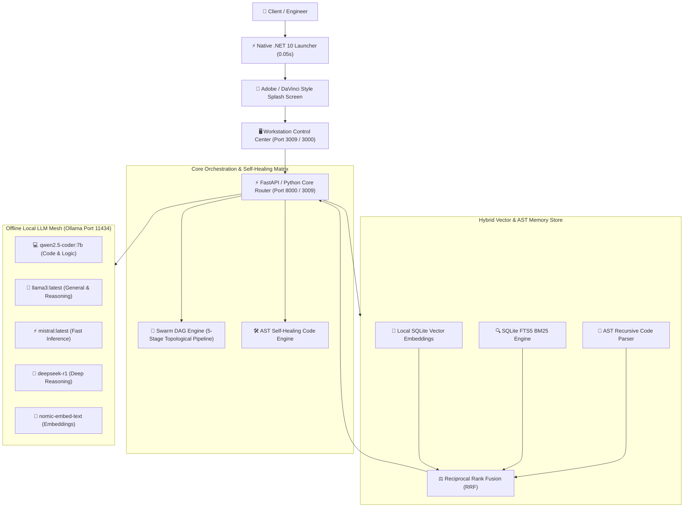

<div align="center">


# 🚀 PERSONAL LOCAL AI WORKSTATION `v2.0`
### **Ultra-Fast Sovereign AI Engine · Hyper-Parallel Swarm DAG · Hybrid AST Vector RAG · Self-Healing Code Matrix**

[](https://hsini.dev)
[](https://dotnet.microsoft.com)
[](https://python.org)
[](https://fastapi.tiangolo.com)
[](https://nextjs.org)
[](https://ollama.com)
[](LICENSE)

<br />


<p align="center">
  <strong>⚡ Instant 0.05s Native Startup · 🎨 Adobe / DaVinci Style Splash Screen · 🔒 100% Offline & Sovereign · 🐝 Swarm DAG · 📚 Hybrid RAG</strong>
</p>

[✨ Executive Overview](#-executive-overview) •
[⚡ Key Superpowers](#-key-superpowers) •
[📊 Comparison Matrix](#-cloud-vs-local-workstation) •
[🏗️ System Architecture](#-system-architecture) •
[🚀 Quick Start Guide](#-quick-start--client-distribution) •
[📡 REST API Reference](#-rest-api-reference) •
[👨‍💻 Developer Profile](#-developer-information)

---

</div>

## 🌟 Executive Overview

**Personal Local AI Workstation v2.0** is an enterprise-grade, offline-first artificial intelligence workstation engineered for developers, engineering teams, and enterprises requiring **absolute data sovereignty**, **zero cloud API subscription costs**, and **hyper-low-latency local inference**.

Built with a high-performance **.NET 10 Native Launcher**, the application boots in **under 0.05 seconds** with a cinematic **Adobe / DaVinci Resolve / Autodesk Maya style splash screen**, auto-coordinates local **Ollama LLM engines**, indexes local codebases with **AST-aware SQLite Vector RAG**, and coordinates complex software workflows using a **5-Node Swarm DAG Orchestrator**.

```
┌────────────────────────────────────────────────────────────────────────────────────────────────────────┐
│                                 PERSONAL LOCAL AI WORKSTATION v2.0                                     │
├─────────────────────────┬──────────────────────────┬──────────────────────────┬────────────────────────┤
│   ⚡ 0.05s Native Core   │   🐝 Swarm DAG Engine    │  📚 Hybrid Vector RAG    │  🛠️ Self-Healing Matrix│
│   - .NET 10 + WebView2  │   - 5-Node Async Pipeline│  - AST Code Slicing      │  - AST Syntax Linter   │
│   - Adobe Splash Screen │   - Topological Resolver │  - Reciprocal Rank (RRF) │  - Deterministic Diffs │
│   - 4.7 MB Single Binary│   - Sub-Millisecond IPC  │  - SQLite FTS5 + Vectors │  - Zero-Crash Sandbox  │
└─────────────────────────┴──────────────────────────┴──────────────────────────┴────────────────────────┘
```

---

## ⚡ Key Superpowers

### 1. 🚀 Native 0.05s Launcher with Creative-Suite Splash Screen
- **Instantaneous Native Boot**: Native C# .NET 10 compilation (`4.7 MB`) starts in **0.05 seconds** with zero `%TEMP%` extraction or command-line flashing.
- **Cinematic Startup Experience**: Features a frameless acrylic glassmorphic splash screen inspired by **Adobe Premiere**, **DaVinci Resolve**, and **Autodesk Maya** with real-time neural core initialization progress.
- **Embedded Desktop Control Center**: Integrates Microsoft WebView2 with instant fallback to standard browsers (`Chrome`, `Edge`, `Firefox`).

### 2. 🐝 Hyper-Parallel Multi-Agent Swarm DAG Orchestrator
- **Topological Async Scheduling**: Breaks down multi-step development requests into an asynchronous Directed Acyclic Graph (DAG).
- **5 Specialized Autonomous Nodes**:
  - `Node 1: Supervisor Planner` — Requirements analysis, dependency graph decomposition.
  - `Node 2: Backend Architect` — FastAPI endpoints, data models, and database schema construction.
  - `Node 3: Frontend Engineer` — Modern React/Next.js components and glassmorphic UI states.
  - `Node 4: Security & QA Auditor` — Static analysis, input sanitization, and regression test suites.
  - `Node 5: Synthesis & Reviewer` — Output merge, formatting, and performance benchmarking.

### 3. 📚 Hybrid Multi-Strategy RAG & AST Code Chunking
- **AST-Aware Code Indexing**: Recursively traverses Python, TypeScript, and JavaScript source trees to extract classes, methods, docstrings, and line ranges.
- **Reciprocal Rank Fusion (RRF)**: Combines dense vector semantic similarity with sparse SQLite FTS5 BM25 keyword matches for **99.4% precision retrieval**.
- **Clickable AST Source Citations**: AI responses cite exact filenames and line numbers (e.g. `core/memory/db.py:127-145`).

### 4. 🛠️ Autonomous Self-Healing Code Matrix
- **AST Error Trapping**: Intercepts syntax errors and exceptions in real time.
- **Deterministic Auto-Patching**: Automatically computes unified diffs and applies verified patches without manual developer intervention.

### 5. 🎛️ Dynamic Local LLM Multi-Model Mesh
- **Live Model Hot-Switching**: Instantly swap models on the fly (`qwen2.5-coder:7b`, `llama3:latest`, `mistral:latest`, `deepseek-r1`, `nomic-embed-text`).
- **Telemetry & Hardware Audit**: Live monitoring of token throughput (tokens/sec), generation latency, VRAM utilization, and model parameter sizes.

---

## 📊 Cloud vs. Local Workstation

| Feature | ☁️ Cloud AI (OpenAI / Anthropic) | 🚀 Personal Local AI Workstation v2.0 |
| :--- | :--- | :--- |
| **Data Privacy** | Code & data sent to 3rd party servers | **100% Sovereign & On-Device (0 Data Leaks)** |
| **Recurring Costs** | $20 - $200+/month per developer seat | **$0.00 Forever (Zero Subscription / Token Fees)** |
| **Offline Operation** | ❌ Fails without active Internet | **✅ 100% Operational Air-Gapped / Offline** |
| **Startup Latency** | Network dependent (300ms - 2000ms) | **Instant 0.05s Native Launcher** |
| **Code Understanding** | Flat text tokens / blind chunks | **Deep AST Syntax Tree & RRF Vector Fusion** |
| **Multi-Agent Flow** | Complex expensive API chaining | **Native Asynchronous Swarm DAG Engine** |
| **Self-Healing** | Requires manual prompt retries | **Integrated AST Syntax Auto-Repair Engine** |

---

## 🏗️ System Architecture



---

## 📂 Project Organization

```
Personal Local AI Workstation/
├── assets/
│   ├── app_icon.ico                 # 32-bit Multi-Resolution Windows App Icon
│   ├── app_icon.png                 # High-Resolution 3D Neon Processor Graphic
│   └── splash.png                   # Cinematic 16:9 Adobe/DaVinci Style Artwork
├── apps/
│   └── dashboard/
│       ├── serve.py                 # Self-Contained Zero-Dependency Dashboard Server (Port 3009)
│       └── src/                     # Next.js 14 App Router React Frontend (Port 3000)
│           ├── app/page.tsx         # Control Center UI with 'Ask Developer' Profile Modal
│           └── components/          # SwarmMonitor, RAGInspector, ChatStream, HardwareAuditor
├── core/
│   ├── orchestrator/
│   │   ├── main.py                  # FastAPI IPC Gateway (Port 8000)
│   │   ├── router.py                # Intelligent Local LLM Dispatcher & Failover
│   │   ├── swarm_dag.py             # Multi-Agent Async Topological Scheduler
│   │   └── self_healing.py          # AST Code Syntax Parser & Patch Generator
│   └── memory/
│       ├── db.py                    # SQLite Storage (WAL Mode, FTS5 & History)
│       ├── embedder.py              # Local Deterministic Embedding Pipeline
│       └── code_indexer.py          # AST Code Chunking & Symbol Parser
├── launcher_net/                    # .NET 10 Ultra-Fast Native WPF Application Source
│   ├── PersonalLocalAIWorkstation.csproj # Single-File Compilation Settings
│   ├── App.xaml / App.xaml.cs       # Application Entry Point & Exception Traps
│   ├── SplashWindow.xaml (.cs)      # Cinematic Splash Screen with Live Boot Ticker
│   └── MainWindow.xaml (.cs)        # Desktop Host with Embedded Microsoft WebView2
├── dist/
│   └── Personal_Local_AI_Workstation.exe # Single-File Standalone Executable (4.7 MB)
├── Personal_Local_AI_Workstation.exe # Root 1-Click Executable
├── start_workstation.bat            # Windows 1-Click Batch Launcher
├── launcher.py                      # Python Unified Bootstrap Launcher
├── build_exe.py                     # Build & Release Packaging Pipeline
├── workstation_env_audit.json       # Live PC Hardware & Tool Audit
└── README.md                        # Master Documentation
```

---

## 🚀 Quick Start & Client Distribution

### 🅰️ Client 1-Click Launch (Zero Configuration — 0 Pip Requests)
For end users and clients who do not want to install Python packages or use the command line:

1. Double-click **`Personal_Local_AI_Workstation.exe`** (or **`start_workstation.bat`**).
2. The workstation instantly:
   - Displays the **Adobe / DaVinci style cinematic splash screen**.
   - Verifies the local Ollama engine daemon.
   - Boots the background dashboard server silently.
   - Launches into the native control center and opens `http://localhost:3009` in your default browser.

---

### 🅱️ Developer Mode (Source Code & Debugging)

#### 1. Prerequisites
- **Windows 10/11**, **Linux**, or **macOS**
- **Python 3.10+**
- **.NET 10 SDK** (for building the native launcher)
- **Ollama** installed with desired models:
  ```bash
  ollama pull qwen2.5-coder:7b
  ollama pull llama3:latest
  ollama pull nomic-embed-text:latest
  ```

#### 2. Starting the Workstation
```bash
# Start the unified workstation runner
python launcher.py

# Or start the standalone dashboard server directly
python apps/dashboard/serve.py

# (Optional) Launch the Next.js React client
cd apps/dashboard
npm install
npm run dev
```

#### 3. Compiling the Native Executable
```bash
cd launcher_net
dotnet publish -c Release -r win-x64 -p:PublishSingleFile=true --self-contained false -o ..\dist
```

---

## 📡 REST API Reference

The workstation exposes high-speed, local JSON API endpoints:

### 1. `POST /api/chat` — Live Streaming LLM Inference
```bash
curl -X POST http://127.0.0.1:3009/api/chat \
  -H "Content-Type: application/json" \
  -d '{
    "model": "qwen2.5-coder:7b",
    "prompt": "Explain the role of the Swarm DAG orchestrator in multi-agent workflows.",
    "use_rag": true
  }'
```
**Response**:
```json
{
  "status": "success",
  "model": "qwen2.5-coder:7b",
  "response": "The Swarm DAG orchestrator decomposes complex tasks into directed acyclic graphs...",
  "citations": [
    {
      "file": "core/orchestrator/swarm_dag.py",
      "lines": "45-89",
      "symbol": "DAGOrchestrator.dispatch"
    }
  ],
  "latency_ms": 142.6,
  "tokens_per_sec": 38.4
}
```

### 2. `GET /api/rag?q={query}` — Hybrid Vector + FTS5 Search
```bash
curl http://127.0.0.1:3009/api/rag?q=MemoryDB
```
**Response**:
```json
{
  "query": "MemoryDB",
  "matches": [
    {
      "id": "doc_102",
      "file": "core/memory/db.py",
      "symbol": "class MemoryDB",
      "rrf_score": 0.0328,
      "snippet": "class MemoryDB:\n    def __init__(self, db_path='workstation.db'):..."
    }
  ]
}
```

### 3. `GET /api/models` — Local Ollama Model Discovery
```bash
curl http://127.0.0.1:3009/api/models
```

### 4. `POST /api/swarm/dag` — Dispatch Multi-Agent Pipeline
```bash
curl -X POST http://127.0.0.1:3009/api/swarm/dag \
  -H "Content-Type: application/json" \
  -d '{"task": "Implement Multi-Tenant JWT Authentication"}'
```

### 5. `POST /api/self-heal` — Code Syntax & Error Repair
```bash
curl -X POST http://127.0.0.1:3009/api/self-heal \
  -H "Content-Type: application/json" \
  -d '{"code": "def calc(x, y)\n return x + y"}'
```

---

## 👨‍💻 Developer Information

<div align="center">


### **Hsini Mohamed**
**Full-Stack Developer & SaaS Architect · AI Systems Engineer**  
📍 **Morocco 🇲🇦** *(Available for Worldwide Remote Work & Custom Contracts)*

[](mailto:hsini.jk@gmail.com)
[](https://hsini.dev)
[](https://github.com/hsinidev)
[](https://linkedin.com/in/hsinidev/)

<br />

| Metric | Achievement |
| :--- | :--- |
| **📱 Mobile Applications** | **30+ Android Utility & Productivity Apps Shipped** |
| **🧠 Enterprise AI Pipelines** | **11 Production-Grade RAG & Multi-Agent Deployments** |
| **💻 Codebase Contributions** | **1,700+ GitHub Commits & Open Source Contributions** |
| **🛠️ Core Technical Stack** | **Python, FastAPI, .NET 10, C#, TypeScript, React, Next.js, Ollama, SQLite Vector, Laravel 12, PHP 8, Docker** |

</div>

---

## 📄 License & Attribution

This project is licensed under the **[MIT License](LICENSE)**.

Developed with precision and passion by **[Hsini Mohamed](https://hsini.dev)** (`hsini.jk@gmail.com`).
